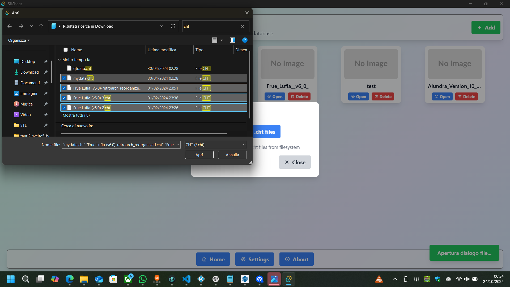
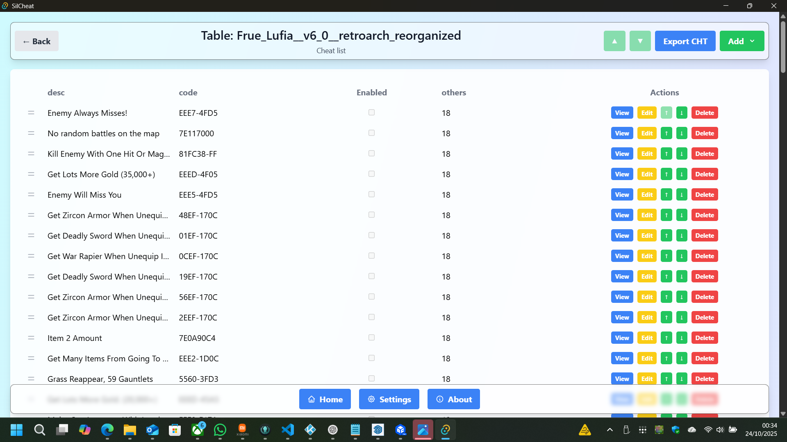
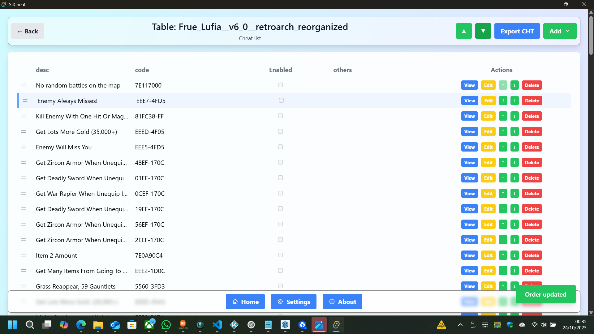
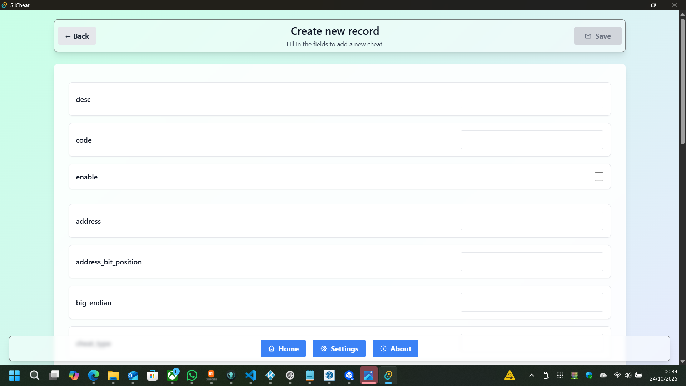
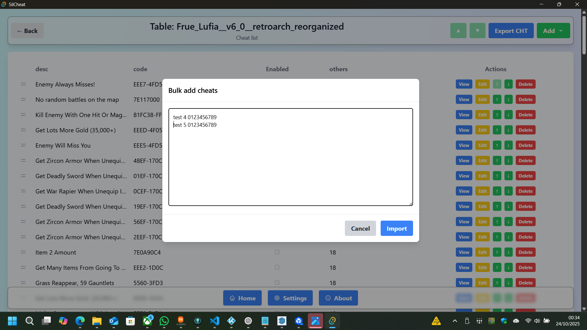
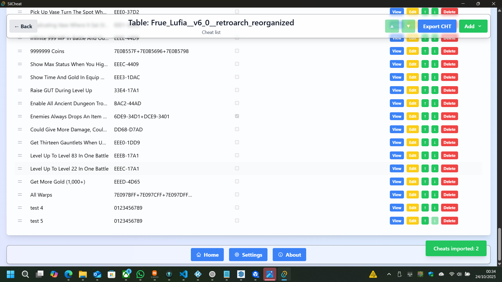
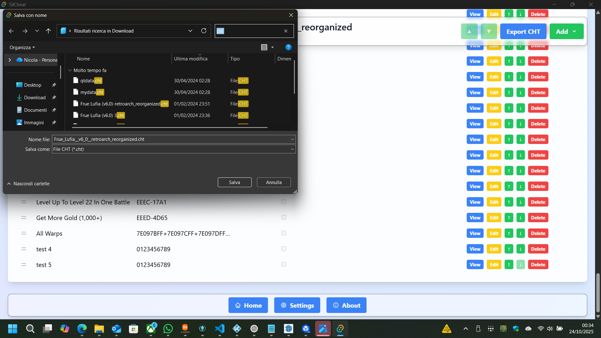

# SilCheat - Cheat Code Manager

SilCheat is a desktop application to manage and organize cheat codes for your favorite games. It lets you import, edit and reorder cheats in a simple and intuitive way.

## Main Features

- **CHT File Import**: Easily load `.cht` files that contain cheat codes to populate your tables.

- **Table Management**: Create and organize separate tables for each game to keep everything tidy.

- **Move Cheats**: Select and change the position of a cheat.

- **View and Edit**: See details for each cheat, edit them or add new ones.

- **Single and Bulk Add**: Add a single cheat or use "Magic add" to paste multiple cheats as free text.

- **Export**: Save your tables as `.cht` files to share or use elsewhere.

- **Logo Download**: Download logo/boxart from external services (RAWG / TheGamesDB) and set them as the table image.

- **Localization (i18n)**: UI texts available in Italian and English (`src/lib/i18n/{it.json,en.json}`); the backend returns i18n keys that are translated by the UI.

---

## Recent changes (changelog)

Below is an extended summary of recent modifications (frontend and backend), test instructions and developer notes.

### Key changes

- Single `Add` button with dropdown: contains `Add one` (single form) and `Magic add` (bulk modal).
- "Bulk add" modal with smart parsing (`src/routes/home/table/+page.svelte`): supports several pasted formats (labelled pairs `desc:`/`code:`, blank-line separated blocks, single-line `desc code`, or alternating lines). It's designed to simplify fast imports of many cheats.
- Migration to stable identifiers: lists now use `id` as the Svelte key to avoid duplicate/duplicate DOM elements.
- Robust drag & drop: integration with SortableJS (handle, fallbackOnBody, ghost/chosen classes) and order saving via `update_record_order` that sends an array of `id`s to the backend.
- Row selection + header Up/Down controls: select a single row and move it with header arrows; a toast appears if nothing is selected.
- Per-row Up/Down buttons and actions: each row has actions (View, Edit, Move up/down, Delete).
- Edit page uses `id`: the edit link and page now look up the record by `id` (no longer by `desc`).
- Home refresh after import: after importing a `.cht` the table list is reloaded automatically.
- Logo functionality: frontend `fetchAndSetLogo()` calls the backend which tries to fetch images from RAWG/TheGamesDB and save them for the table.
- Backend localization → i18n keys: the backend now returns error keys (e.g. `settings.api_key_missing`, `home.no_game_found_rawg`, `table.duplicate_desc`) instead of hard-coded Italian strings. These keys are translated in `src/lib/i18n/it.json` and `src/lib/i18n/en.json`.

## Contributing

If you'd like to contribute: open an issue or a PR with a clear description of the feature or bug and, if possible, include reproduction steps. For changes to the bulk parser, include real input examples you want supported.

---

For questions or support, contact the maintainer.