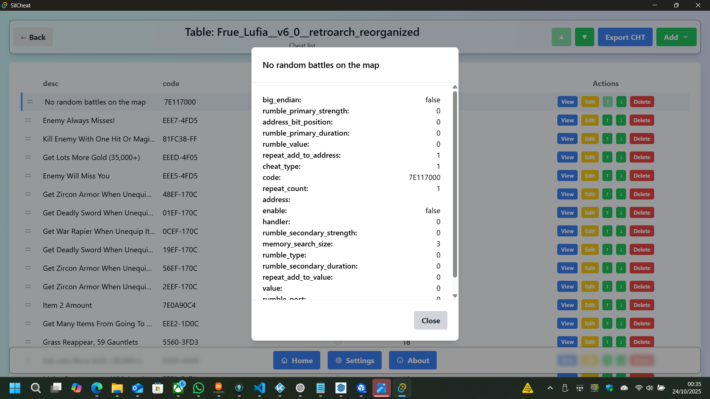
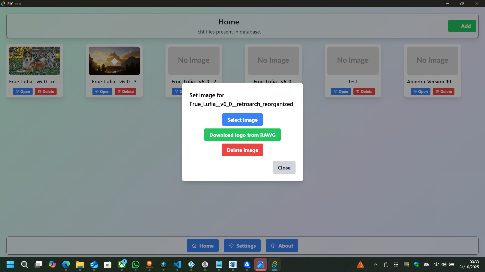
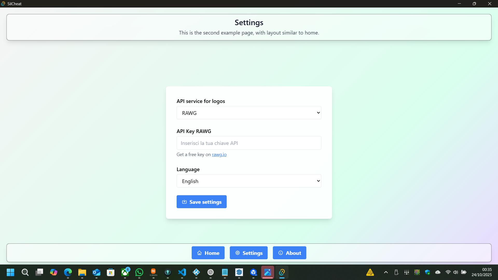

# SilCheat - Gestore di Codici Cheat

SilCheat è un'applicazione desktop per gestire e organizzare codici cheat per i tuoi giochi preferiti. Ti permette di importare, modificare e riordinare i cheat in modo semplice e intuitivo.

## Funzionalità Principali

- **Importazione di File CHT**: Carica facilmente file `.cht` contenenti codici cheat per popolare le tue tabelle.

- **Gestione delle Tabelle**: Crea e organizza tabelle separate per ciascun gioco, mantenendo tutto ordinato.

- **Spostamento cheat**: Selezione e cambia posizione di un cheat.

- **Visualizzazione e Modifica**: Visualizza i dettagli di ciascun cheat, modificali o aggiungine di nuovi.

- **Aggiunta singola e bulk**: Aggiungi un singolo cheat o usa il "Magic add" per incollare più cheat in testo libero.

- **Esportazione**: Salva le tue tabelle in formato `.cht` per condividerle o utilizzarle altrove.

- **Download Logo**: Scarica logo/boxart da servizi esterni (RAWG / TheGamesDB) e impostali come immagine della tabella.

- **Localizzazione (i18n)**: Testi UI disponibili in italiano e inglese (`src/lib/i18n/{it.json,en.json}`); il backend restituisce chiavi i18n che la UI traduce.

---

## Novità recenti (changelog)

Qui sotto trovi un riepilogo esteso delle modifiche recenti (frontend e backend), istruzioni di test e note per sviluppatori.

### Modifiche principali

- Unico pulsante `Add` con menu a tendina: contiene `Add one` (form singolo) e `Magic add` (modal bulk).
- Modal "Bulk add" con parsing intelligente (`src/routes/home/table/+page.svelte`): supporta diversi formati incollati (coppie etichettate `desc:`/`code:`, blocchi separati da righe vuote, righe singole con `desc code` o righe alternate). È pensato per semplificare l'import rapido di molti cheat.
- Migrazione a identificatori stabili: le liste usano ora `id` come chiave Svelte per evitare duplicazioni/doppi elementi in DOM.
- Drag & drop robusto: integrazione con SortableJS (handle, fallbackOnBody, ghost/chosen classes) e salvataggio ordine tramite `update_record_order` che invia array di `id` al backend.
- Selezione riga + controlli header Up/Down: seleziona una riga singola e spostala con le frecce nella testata; viene mostrato un toast di avviso se nulla è selezionato.
- Pulsanti Up/Down per riga e azioni: ogni riga ha azioni (View, Edit, Move up/down, Delete).
- Pagina di modifica usa `id`: l'edit link e la pagina di modifica cercano ora il record per `id` (non più `desc`).
- Home refresh dopo import: dopo l'importazione di `.cht` la lista delle tabelle viene ricaricata automaticamente.
- Funzionalità logo: frontend `fetchAndSetLogo()` invoca il backend che prova a recuperare immagini da RAWG/TheGamesDB e le salva per la tabella.
- Localizzazione backend → i18n keys: il backend ora restituisce chiavi di errore (es. `settings.api_key_missing`, `home.no_game_found_rawg`, `table.duplicate_desc`) invece di messaggi hard-coded in italiano. Queste chiavi sono tradotte nei file `src/lib/i18n/it.json` e `src/lib/i18n/en.json`.

## Contribuire

Se vuoi contribuire: apri issue o PR con descrizione chiara della feature o bug e, se possibile, includi passi per riprodurre. Per modifiche al parser bulk, indica esempi di input reali che vuoi supportare.

---

Per domande o supporto, contatta lo sviluppatore.
